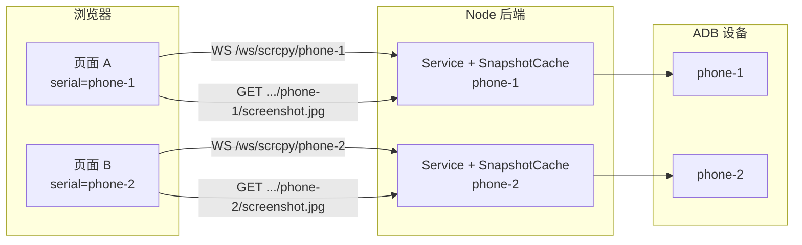

# 多设备截图集成说明（Web 端）

本文档面向 **Web 前端 / Web 全栈**，说明在使用 `@9b9387/android-stream-scrcpy` 做多设备推流时，如何正确获取各设备的截图。

> **适用范围**：Node.js 后端 + 浏览器前端。截图由后端 ffmpeg 从 H.264 流解码生成，浏览器 **不能** 直接调用库的 snapshot API。

---

## 1. 核心结论

| 能力                   | 单设备 vs 多设备                                                                       |
| ---------------------- | -------------------------------------------------------------------------------------- |
| 推流（WebSocket）      | 每台设备需要 **独立的 WebSocket 路径或会话**                                           |
| 截图（HTTP）           | 每台设备需要 **独立的截图 URL**，且后端为每台设备维护 **独立的 `FfmpegSnapshotCache`** |
| 全局 `/screenshot.jpg` | **仅适用于单设备**；多设备场景下两个页面会抢同一路由，导致 404 或拿到错误设备的图      |

**Web 端需要做的**：在连接某台设备时，始终用 **同一个 `deviceSerial`** 去连 WebSocket 和拉截图。

**后端需要做的**（通常由 Web 项目的 Node 服务实现，**不必修改 npm 库本身**）：按设备 serial 管理 session，并为每台设备分别创建 `ScrcpyStreamService` + `FfmpegSnapshotCache`。

---

## 2. 架构示意



原则：**一路推流 + 一份截图缓存 = 一台设备**。不要多个 WebSocket 共用一个截图 endpoint。

---

## 3. 后端约定（Web 端依赖的 API 契约）

请与后端对齐以下约定。下文以 **按 serial 路径路由** 为例（推荐）。

### 3.1 设备标识

- 使用 ADB serial 作为设备唯一 ID，例如 `emulator-5554`、`R58M123ABCD`。
- URL 中必须做 `encodeURIComponent(serial)`，避免 serial 含特殊字符时路由错误。

### 3.2 WebSocket 推流

| 项目     | 说明                                                                               |
| -------- | ---------------------------------------------------------------------------------- |
| 推荐路径 | `ws(s)://{host}/ws/scrcpy/{deviceSerial}`                                          |
| 连接时机 | 用户选择设备并开始投屏时                                                           |
| 首包     | JSON `init` 消息，含分辨率、codec 等（见 [WebSocket 协议](#5-websocket-协议摘要)） |
| 后续     | 二进制媒体包（16 字节头 + payload）                                                |

每个 `deviceSerial` 对应后端一个独立的 `ScrcpyWebSocketBridge`（或等价实现）。

### 3.3 HTTP 截图

| 项目         | 说明                                                               |
| ------------ | ------------------------------------------------------------------ |
| 推荐路径     | `GET /devices/{deviceSerial}/screenshot.jpg`                       |
| 备选         | `GET /screenshot.jpg?device={deviceSerial}`                        |
| Content-Type | `image/jpeg`                                                       |
| 缓存         | 必须 `Cache-Control: no-store`；前端建议加 `?t={timestamp}` 防缓存 |
| 成功         | `200` + JPEG body                                                  |
| 失败         | 见 [错误处理](#6-错误处理)                                         |

### 3.4 可选：设备列表

若页面需要从服务端发现设备，可增加：

```http
GET /api/devices
```

响应示例：

```json
{
  "devices": [
    { "serial": "emulator-5554", "state": "running", "name": "Pixel_6" },
    { "serial": "R58M123ABCD", "state": "idle", "name": "Galaxy_S21" }
  ]
}
```

具体字段由业务定义；Web 端至少需要 `serial` 用于 WS 与截图 URL。

---

## 4. Web 前端集成步骤

### 4.1 状态里保存当前设备 serial

```typescript
interface StreamSession {
  deviceSerial: string;
  ws: WebSocket | null;
}

const session: StreamSession = {
  deviceSerial: "emulator-5554",
  ws: null,
};
```

**规则**：页面当前展示哪台设备的画面，`deviceSerial` 就必须是哪一台。不要用全局固定的 `/screenshot.jpg`。

### 4.2 连接 WebSocket

```typescript
function connectStream(deviceSerial: string): WebSocket {
  const wsUrl = new URL(
    `/ws/scrcpy/${encodeURIComponent(deviceSerial)}`,
    window.location.origin.replace(/^http/, "ws"),
  );

  const ws = new WebSocket(wsUrl.toString());
  ws.binaryType = "arraybuffer";

  ws.onmessage = (event) => {
    if (typeof event.data === "string") {
      const msg = JSON.parse(event.data);
      if (msg.type === "init") {
        // 初始化解码器：msg.device.width / height / video_codec 等
      }
      return;
    }
    // 解析二进制媒体包（16 字节头 + payload）
  };

  return ws;
}
```

### 4.3 下载 / 预览截图

```typescript
function screenshotUrl(deviceSerial: string): string {
  const path = `/devices/${encodeURIComponent(deviceSerial)}/screenshot.jpg`;
  const url = new URL(path, window.location.origin);
  url.searchParams.set("t", String(Date.now())); // 避免浏览器缓存
  return url.toString();
}

async function downloadScreenshot(deviceSerial: string): Promise<void> {
  const response = await fetch(screenshotUrl(deviceSerial), {
    cache: "no-store",
  });

  if (!response.ok) {
    const text = await response.text();
    throw new Error(text || `HTTP ${response.status}`);
  }

  const blob = await response.blob();
  const objectUrl = URL.createObjectURL(blob);
  const link = document.createElement("a");
  link.href = objectUrl;
  link.download = `screenshot-${deviceSerial}-${Date.now()}.jpg`;
  document.body.appendChild(link);
  link.click();
  link.remove();
  URL.revokeObjectURL(objectUrl);
}
```

### 4.4 在 `` 中预览最新截图

```typescript
async function refreshScreenshotPreview(
  deviceSerial: string,
  img: HTMLImageElement,
): Promise<void> {
  const response = await fetch(screenshotUrl(deviceSerial), {
    cache: "no-store",
  });
  if (!response.ok) {
    throw new Error(await response.text());
  }
  const blob = await response.blob();
  img.src = URL.createObjectURL(blob);
}
```

### 4.5 多标签页 / 多窗口

- **每个页面**各自维护 `deviceSerial`，互不影响。
- 两个页面分别打开 `phone-1` 和 `phone-2` 时，应分别请求：
  - `/devices/phone-1/screenshot.jpg`
  - `/devices/phone-2/screenshot.jpg`
- 若两页都用 `/screenshot.jpg`，则只有一台设备（或无人）能拿到正确截图。

### 4.6 切换设备

用户从设备 A 切到设备 B 时：

1. 关闭 A 的 WebSocket
2. 更新 `deviceSerial = B`
3. 连接 B 的 WebSocket
4. 截图按钮改为请求 B 的 URL

不要在切换后仍用 A 的 serial 拉截图。

---

## 5. WebSocket 协议摘要

连接成功后，服务端会先发送 JSON：

```json
{
  "type": "init",
  "state": "running",
  "device": {
    "name": "Pixel_6",
    "width": 1080,
    "height": 2400,
    "video_codec": "h264",
    "audio_codec": "opus"
  },
  "binary_header": {
    "size": 16,
    "kinds": { "video": 1, "audio": 2, "session": 3 },
    "flags": { "config": 1, "key_frame": 2, "client_resized": 4 }
  }
}
```

> **注意**：`init.device.name` 是设备显示名，**不是** ADB serial。截图 URL 必须使用 **serial**（路由里用的那个 ID），不要误用 `name`。

后续为二进制帧，详见库 README「Integrate The WebSocket Bridge」一节。

---

## 6. 错误处理

Web 端应对 HTTP 状态与 body 做友好提示：

| HTTP  | Body 示例                              | 含义                                                            | Web 端建议                             |
| ----- | -------------------------------------- | --------------------------------------------------------------- | -------------------------------------- |
| `503` | `snapshot not available within 3000ms` | session 已存在，但等待窗口内 ffmpeg 未产出帧（刚连接/设备息屏） | 提示「截图准备中」，稍后重试           |
| `404` | `snapshot cache is disabled`           | 后端未启用该设备的 snapshot                                     | 隐藏截图按钮或提示「未开启截图」       |
| `404` | 路由不存在                             | URL 未带 serial 或后端未实现多设备路由                          | 检查是否仍使用单设备 `/screenshot.jpg` |
| `500` | 错误信息文本                           | 设备连接失败、ffmpeg 异常等                                     | 展示 message，并查后端日志             |
| `200` | JPEG                                   | 成功                                                            | 下载或展示                             |

> 后端使用 `snapshot.waitForFresh(ms)` 后，"暂时无帧"统一返回 **503**（而非旧的
> `404 no screenshot available yet`）。这样单个请求最多等待 `ms`，不会无限挂起，
> 前端也无需自旋轮询。

建议在 UI 上区分：

- **网络 / 路由错误**（404 且无已知 body）
- **暂时无帧 / 准备中**（`503`，可延迟自动重试）
- **服务未配置**（`snapshot cache is disabled`）

---

## 7. 后端参考实现（供 Web 全栈 / 后端同学）

以下为推荐的多设备 session 管理器，Web 项目 Node 层实现即可，**无需 fork npm 包**。
它解决了线上最常见的两类问题：**内存/进程泄露** 与 **截图超时**。

> ⚠️ **务必照抄这套写法，不要用"先 `get` 判空、再 `await start`、最后 `set`"的朴素实现**——
> 那种写法在并发请求下会创建重复 session，旧的一套（service + ffmpeg + bridge）成为
> 孤儿永不回收，是内存泄露的头号原因。

### 7.1 会话管理器（去重 + 引用计数 + 空闲回收）

```typescript
import { createServer } from "node:http";
import {
  FfmpegSnapshotCache,
  ScrcpyStreamService,
} from "@9b9387/android-stream-scrcpy";
import { ScrcpyWebSocketBridge } from "@9b9387/android-stream-scrcpy/websocket";

type DeviceSession = {
  service: ScrcpyStreamService;
  snapshot: FfmpegSnapshotCache;
  bridge: ScrcpyWebSocketBridge;
  refs: number; // 活跃 WS 连接数
  idleTimer?: NodeJS.Timeout;
};

// 关键点 1：缓存的是 Promise，不是结果。并发请求拿到同一个 Promise，天然去重。
const sessions = new Map<string, Promise<DeviceSession>>();
const IDLE_TTL_MS = 30_000; // 无人观看 30s 后回收

function getOrCreateSession(
  server: ReturnType<typeof createServer>,
  serial: string,
): Promise<DeviceSession> {
  let pending = sessions.get(serial);
  if (pending) return pending;

  pending = (async () => {
    const service = new ScrcpyStreamService({
      deviceSerial: serial,
      maxSize: 720,
      video: true,
      audio: true,
      control: true,
    });
    const snapshot = new FfmpegSnapshotCache(service, {
      enabled: true,
      fps: 2,
      quality: 85,
      ffmpegPath: process.env.FFMPEG_PATH || "ffmpeg",
    });

    try {
      await service.start();
      snapshot.start(); // 必须在 service.start() 之后
    } catch (e) {
      // 关键点 2：启动失败要清理并从 Map 删除，否则缓存了一个坏 Promise，
      // 之后所有请求都会拿到同一个失败结果，且资源没释放。
      snapshot.stop();
      service.stop();
      sessions.delete(serial);
      throw e;
    }

    const bridge = new ScrcpyWebSocketBridge(service, {
      server,
      path: `/ws/scrcpy/${encodeURIComponent(serial)}`,
    });

    // 关键点 3：设备出错时自动销毁，避免坏 session 永久驻留。
    service.on("error", () => {
      destroySession(serial).catch(() => {});
    });

    return { service, snapshot, bridge, refs: 0 };
  })();

  sessions.set(serial, pending);
  return pending;
}

async function destroySession(serial: string): Promise<void> {
  const pending = sessions.get(serial);
  if (!pending) return;
  sessions.delete(serial);
  try {
    const s = await pending;
    if (s.idleTimer) clearTimeout(s.idleTimer);
    s.snapshot.stop(); // 杀掉 ffmpeg
    s.bridge.close(); // 关闭 WebSocketServer
    s.service.stop(); // 关闭 ADB socket / worker loop
  } catch {
    // 启动本就失败，无需再清理
  }
}

// WS 连接建立时 acquire，关闭时 release。空闲到期自动回收。
function acquire(s: DeviceSession): void {
  s.refs += 1;
  if (s.idleTimer) {
    clearTimeout(s.idleTimer);
    s.idleTimer = undefined;
  }
}

function release(serial: string, s: DeviceSession): void {
  s.refs = Math.max(0, s.refs - 1);
  if (s.refs === 0 && !s.idleTimer) {
    s.idleTimer = setTimeout(() => destroySession(serial), IDLE_TTL_MS);
  }
}
```

### 7.2 启动时机：把 `start()` 移出截图请求路径

`service.start()` 包含推送 server.jar、连接 socket、握手等步骤，**可能耗时数秒**。
不要让第一个截图请求同步等待整个启动——那正是"截图超时"的来源。推荐：

- **设备进入可见列表 / WS 连接建立时** 就触发 `getOrCreateSession()`（预热）；
- 截图请求只负责读已有 session 的最新帧。

### 7.3 WebSocket 路由（带引用计数）

```typescript
// 由 ScrcpyWebSocketBridge 自行处理 upgrade；这里只做 session 预热与计数。
server.on("upgrade", async (req) => {
  const m = (req.url || "").match(/^\/ws\/scrcpy\/([^/?]+)/);
  if (!m) return;
  const serial = decodeURIComponent(m[1]);
  const s = await getOrCreateSession(server, serial);
  acquire(s);
  // bridge 内部的 ws "close" 会触发；用它来 release：
  s.bridge; // 已绑定到 server，同 path 的连接由它接管
});
// 简化做法：在你自己的连接跟踪里，于 ws "close" 调 release(serial, s)。
```

### 7.4 HTTP 截图路由（用 `waitForFresh`，不要自旋轮询）

```typescript
// GET /devices/:serial/screenshot.jpg
const match = url.pathname.match(/^\/devices\/([^/]+)\/screenshot\.jpg$/);
if (match) {
  const serial = decodeURIComponent(match[1]);
  const session = await getOrCreateSession(server, serial);

  try {
    // 已有帧立即返回；否则最多等 3s 等首帧/新帧，再不行就抛错。
    const shot = await session.snapshot.waitForFresh(3000);
    res.writeHead(200, {
      "content-type": shot.contentType,
      "content-length": String(shot.data.byteLength),
      "cache-control": "no-store",
    });
    res.end(shot.data);
  } catch (e) {
    // 503 = 暂时没图（设备刚连/编码器未产帧），客户端可稍后重试。
    res.writeHead(503, { "content-type": "text/plain; charset=utf-8" });
    res.end((e as Error).message || "no screenshot available yet");
  }
}
```

> `waitForFresh(timeoutMs)` 取代了"`latest()` 为空就 404、客户端不停轮询"的老模式：
> 单个请求最多挂起 `timeoutMs`，不会无限等待，客户端也不必自旋。

### 后端检查清单

- [ ] 用 **缓存 Promise** 的 `getOrCreateSession`，并发请求不会创建重复 session
- [ ] 启动失败时 `stop()` 并 `sessions.delete(serial)`
- [ ] 每台设备一个 `ScrcpyStreamService` + 一个 `FfmpegSnapshotCache`，`snapshot.start()` 在 `service.start()` 之后
- [ ] 有 **会话回收**：WS 全部断开后空闲超时调 `destroySession()`（`snapshot.stop()` + `bridge.close()` + `service.stop()`）
- [ ] `service.on("error")` → `destroySession()`，坏会话不驻留
- [ ] 截图路由用 `await snapshot.waitForFresh(ms)`，超时返回 **503** 而非永久 404
- [ ] `service.start()` 不放在截图请求的关键路径上（提前预热）
- [ ] 服务器已安装 `ffmpeg`（或配置 `FFMPEG_PATH`）
- [ ] 视频 codec 为 H.264（snapshot 当前仅支持 h264）

---

## 8. 常见问题

### Q1：两页都能推流，为什么截图失败？

最常见原因：**WebSocket 已按设备拆分，截图仍共用一个 URL**（例如都叫 `/screenshot.jpg`）。按本文第 3、4 节改为按 serial 路由即可。

### Q2：截图总是另一台手机的画面？

后端只有一个 `FfmpegSnapshotCache`，或 HTTP 路由没有按 serial 分发。每台设备单独建 cache。

### Q3：返回 `503 snapshot not available` 但画面已经在播？

1. 刚连上时 ffmpeg 需要 1–2 秒产出首帧；后端已用 `waitForFresh` 等待，仍超时可适当调大 `timeoutMs` 或稍后重试
2. 后端忘记 `snapshot.start()`
3. 该 session 的 snapshot 绑错了 service（检查 Map key 是否为 serial）
4. 设备息屏 / 编码器暂停导致无新帧——可监听 `snapshot.on("stale", ...)` 做告警

### Q6：会话会不会一直累积导致内存/进程泄露？

不会——前提是按第 7 节实现 **会话回收**：所有 WS 断开后空闲超时调用 `destroySession()`
（内部 `snapshot.stop()` 杀 ffmpeg、`bridge.close()`、`service.stop()`），并在
`service.on("error")` 时也销毁。库侧已保证：service 停止/出错时会自动联动关闭其
`FfmpegSnapshotCache` 的 ffmpeg 进程，不会留下孤儿进程。

### Q4：能否在浏览器里直接从 WebSocket 截帧，不用 HTTP？

可以（例如用 WebCodecs 解码后 `canvas.toDataURL`），但：

- 实现复杂度和内存占用更高
- 与当前库的 `FfmpegSnapshotCache` 方案无关
- 若后端已提供按设备截图 API，**推荐继续走 HTTP**，前后端职责清晰

### Q5：需要改 `@9b9387/android-stream-scrcpy` 这个库吗？

一般 **不需要**。库提供单设备原语；多设备编排属于 Web 项目后端职责。仅在多个项目重复相同逻辑时，才考虑在业务层抽公共 `DeviceSessionManager`。

---

## 9. 从单设备迁移的检查表

若此前参考 `examples/server.ts`（单设备）集成，请逐项核对：

| 项目           | 单设备（旧）              | 多设备（新）                       |
| -------------- | ------------------------- | ---------------------------------- |
| WebSocket      | `/ws/scrcpy`              | `/ws/scrcpy/{serial}`              |
| 截图           | `/screenshot.jpg`         | `/devices/{serial}/screenshot.jpg` |
| 前端 fetch     | 固定 URL                  | URL 含当前 `deviceSerial`          |
| 后端实例       | 1 个 service + 1 个 cache | 每 serial 1 套                     |
| 打开第二台设备 | 不适用                    | 新建 session，不要复用全局 cache   |

---

## 10. 相关文档

- 库 README：[../README.md](../README.md) — 安装、WebSocket 二进制格式、Snapshot API
- 单设备示例：[../examples/server.ts](../examples/server.ts) — 仅作参考，多设备需自行扩展路由

如有疑问，请向后端确认 **截图 API 的路径规范** 与 **deviceSerial 的来源**（ADB serial，而非设备显示名）。
